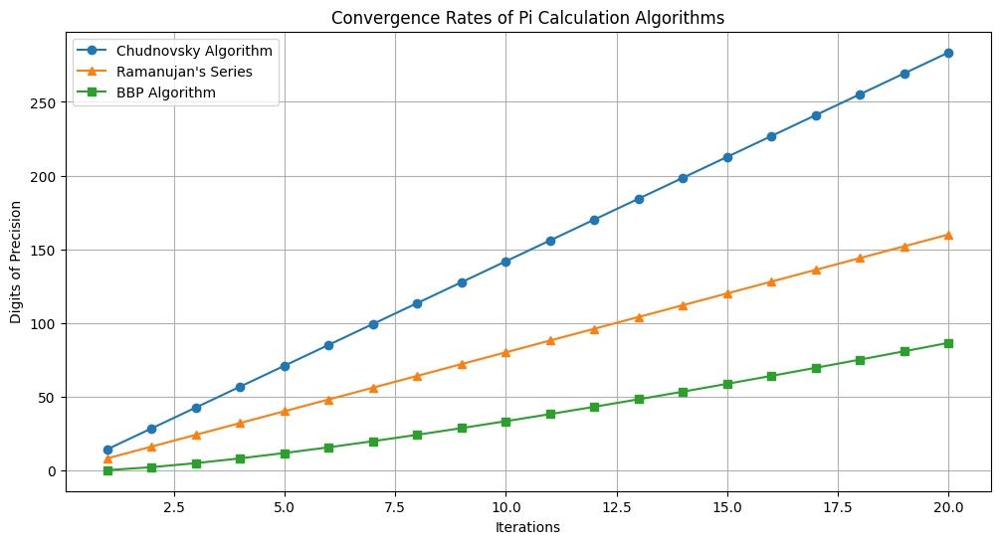

# Calculate pi

## Introduction
In this assignment, we will examine 3 algorithms (Chudnovsky, Ramanujan and BBP) to calculate π up to 1000 digits
**_and_** Write a simple program with semaphore.
## Algorithms for calculating π 📊
1. [**Ramanujan's Series:**](https://en.wikipedia.org/wiki/Ramanujan%E2%80%93Sato_series)
   Ramanujan was an Indian self-study mathematician who around 1910, quite astonished, invented the following infinite series formula for π\
\
For each term in the series, it produces approx eight more correct digits of π.
In the quest for calculating π, this particular formula was used in 1985 to calculate approx 17 million digits of π.

2. [**Chudnovsky Algorithm:**](https://en.wikipedia.org/wiki/Chudnovsky_algorithm)
   Chudnovsky brother found a variation of the Ramanujan infinite series for π in 1989 using the infinite series:\
\
For each term in the series, it produces approx. 14 more correct digits of π, 
which is six digits more than the Ramanujan series per term. In 1994, the formula was used to calculate approx 4 billion digits of π. 
Again in 2010 and 2011, it reach 10 billion digits of π, and finally in 2022 100 trillion digits of π.

3. [**Bailey–Borwein–Plouffe (BBP) Algorithm:**](https://en.wikipedia.org/wiki/Bailey%E2%80%93Borwein%E2%80%93Plouffe_formula)
The BBP formula, discovered by Bailey, Borwein, and Plouffe in 1995, allows for the efficient computation of individual hexadecimal digits of π.
The formula is given by:\
\
   This remarkable formula calculates one hexadecimal digit of π per term in the series, making it highly efficient for digit extraction and computation.

* The Chudnovsky and Ramanujan series first calculate 1/π, but the BBP series directly calculates π.
* **Approximately**, the convergence rate of these series can be compared like this:

## Report 📝
- To calculate π up to 1000 digits using Java, we need to use the 'BigDecimal' package, as Java's default decimal precision is insufficient for such a task.Considering that in all three series, the calculation of each term is independent of the others, we can increase the calculation speed by implementing the program with **multithreading**, where each term is calculated by an independent thread.
- Although **Chudnovsky's algorithm** was expected to have a higher convergence rate than the other series, it was only able to calculate 15 digits with 500 terms. This issue likely arises because the denominator of each term in this series involves a decimal exponent. Since 'BigDecimal' doesn't support decimal exponents directly, we were forced to use logarithms to address this problem, which probably reduced the series' accuracy.
- **The Ramanujan series** calculated π to a thousand digits with 126 terms. The **BBP algorithm** managed to achieve this precision with about 850 terms.

## Conclusion 🎯
We conclude that under our conditions, the **Ramanujan series** has the highest convergence rate. Furthermore, the computational load of each term in the Ramanujan series is substantial, which justifies the use of a multithreading approach. This reduces the overhead of thread management compared to methods with smaller tasks.

## Semaphore and its use 🧐
A [**semaphore**](https://www.geeksforgeeks.org/semaphore-in-java/) is a synchronization tool used in concurrent programming to control access to a shared resource by multiple threads.
It maintains a set of permits, and threads must acquire a permit before accessing the resource. If no permits are available, the thread waits until one is released.
**Uses in Java:**
* Managing Resource Access: Ensures that only a limited number of threads can access a resource, like a pool of database connections.
* Synchronizing Threads: Allows threads to wait for a certain condition to be met before proceeding.
* Controlling Execution Order: Ensures that certain operations are completed before others start.

## Resources 📚
* [Algorithms for calculating π](https://en.wikipedia.org/wiki/Approximations_of_%CF%80)
* [Calculating Value of PI using java](https://connect2grp.medium.com/java-calculate-value-of-pi-using-math-formulas-part-1-66362755b998)
* [Practical implementation of π Algorithms with arbitrary precision with c++](https://www.researchgate.net/publication/334389278_Practical_implementation_of_p_Algorithms_with_arbitrary_precision)
* [Implementation of Chudnovsky's algorithm with Python](https://www.craig-wood.com/nick/articles/pi-chudnovsky/)
* [Multithreading in Java](https://www.simplilearn.com/tutorials/java-tutorial/multithreading-in-java)
* [more about semaphore usage](https://www.linkedin.com/pulse/what-semaphore-when-use-a-n-m-bazlur-rahman)

## Similar projects 💻
* [Calculate Pi using Leibniz's Formula](https://github.com/Nefari0uss/calculate-pi) by @Nefari0uss
* [Calculating π](https://github.com/BaseMax/pi) by @BaseMax
* [Thread Pool for Fast Calculation of π](https://github.com/BardiParsi/piCalculator) by @BardiParsi
* [Monte Carlo π approximation](https://github.com/AleksaMCode/monte-carlo-pi-approximation) by @AleksaMCode

